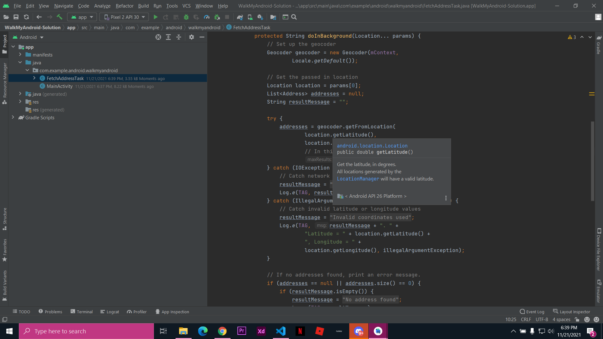

# Jobsheet 11
## 1.Buatlah rangkuman dari hasil mempelajari materi dari slide pertemuan ke-11 tersebut ke dalam bentuk Laporan Praktikum di folder 11_Location/11.md (menggunakan Mark down seperti biasanya)!

### Kerangka kerja sensor Android menyediakan akses ke data yang berasal dari serangkaian sensor perangkat. Sensor-sensor tersebut antara lain akselerometer, giroskop, magnetometer, barometer, sensor kelembapan, sensor cahaya, sensor jarak, dan sebagainya.The SensorManagerlayanan memungkinkan akses dan daftar aplikasi sensor dan mendengarkan acara sensor ( SensorEvent). Manajer sensor adalah layanan sistem yang dapat Anda minta dengan getSystemService().The Sensorkelas merupakan sensor yang spesifik dan berisi metode untuk menunjukkan sifat-sifat dan kemampuan sensor yang diberikan. Ini juga menyediakan konstanta untuk jenis sensor, yang menentukan bagaimana sensor berperilaku dan data apa yang mereka berikanGunakan getSensorList(Sensor.TYPE_ALL)untuk mendapatkan daftar semua sensor yang tersedia.Gunakan getDefaultSensor()dengan tipe sensor untuk mendapatkan akses ke sensor tertentu sebagai Sensorobjek.Sensor menyediakan data melalui serangkaian peristiwa sensor. Sebuah SensorEventobjek mencakup informasi tentang sensor yang dihasilkan itu, waktu, dan data baru. Data yang disediakan sensor bergantung pada jenis sensor. Sensor sederhana seperti sensor cahaya dan jarak hanya melaporkan satu nilai data, sedangkan sensor gerak seperti akselerometer menyediakan larik data multidimensi untuk setiap peristiwa.Aplikasi Anda menggunakan pemroses sensor untuk menerima data sensor. Implementasikan SensorEventListenerantarmuka untuk mendengarkan peristiwa sensor.Gunakan onSensorChanged()metode untuk menangani peristiwa sensor individual. Dari SensorEventobjek yang diteruskan ke metode itu, Anda bisa mendapatkan sensor yang menghasilkan peristiwa dan data baru.Daftarkan pendengar sensor dalam onResume()metode siklus hidup, dan batalkan pendaftarannya di onPause(). Melakukan hal ini akan mencegah aplikasi Anda menggambar sumber daya sistem saat aplikasi Anda tidak berada di latar depan.Gunakan registerListener()metode untuk mendengarkan peristiwa sensor. Pendaftaran pendengar mencakup jenis sensor yang diminati aplikasi Anda, dan kecepatan yang lebih disukai aplikasi Anda untuk menerima data. Kecepatan data yang lebih tinggi menyediakan lebih banyak peristiwa data, tetapi menggunakan lebih banyak sumber daya sistem.Gunakan unregisterListener()metode untuk berhenti mendengarkan peristiwa sensor.

### Informasi lokasi tersedia melalui FusedLocationProviderClient.Menggunakan layanan lokasi memerlukan izin lokasi.Izin lokasi dikategorikan sebagai "izin berbahaya", jadi Anda harus menyertakannya dalam manifes dan memintanya saat runtime.Gunakan getLastLocation()metode untuk mendapatkan lokasi terakhir perangkat yang diketahui dari file FusedLocationProviderClient.Proses mengubah satu set koordinat (bujur dan lintang) menjadi alamat fisik disebut geocoding terbalik . Geocoding terbalik tersedia melalui metode Geocoderkelas getFromLocation().The getFromLocation()metode adalah sinkron dan mungkin memerlukan waktu untuk lengkap, sehingga Anda tidak harus menggunakannya di thread utama.Gunakan a LocationRequestuntuk menentukan persyaratan akurasi dan frekuensi pembaruan lokasi Anda.Asalkan pengaturan perangkat sesuai, gunakan FusedLocationProviderClientuntuk meminta pembaruan lokasi berkala dengan requestLocationUpdates().Hentikan pembaruan lokasi dengan FusedLocationProviderClient removeLocationUpdates()metode.

## 2.Buatlah laporan hasil percobaan aplikasi terkait sensor-sensor yang ada di repo ini:
### Task 1

### Task 2

#### hasil

## 3.Buatlah laporan hasil percobaan aplikasi terkait location/map menggunakan GPS yang ada di repo ini:

#### hasil

