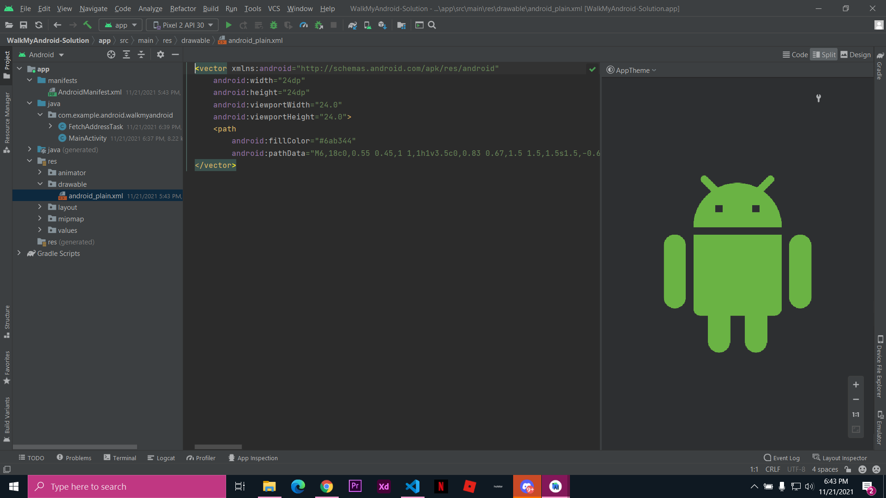

# Jobsheet 11
## 1.Buatlah rangkuman dari hasil mempelajari materi dari slide pertemuan ke-11 tersebut ke dalam bentuk Laporan Praktikum di folder 11_Location/11.md (menggunakan Mark down seperti biasanya)!
###
## 2.Buatlah laporan hasil percobaan aplikasi terkait sensor-sensor yang ada di repo ini:
### Task 1

### Task 2

#### hasil

## 3.Buatlah laporan hasil percobaan aplikasi terkait location/map menggunakan GPS yang ada di repo ini:

#### hasil

